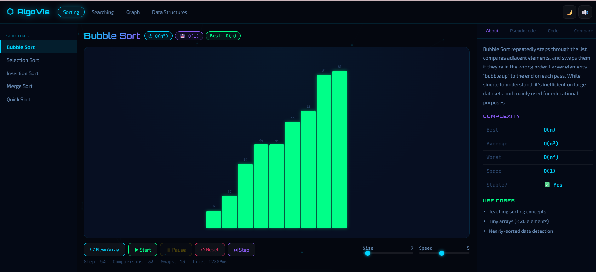
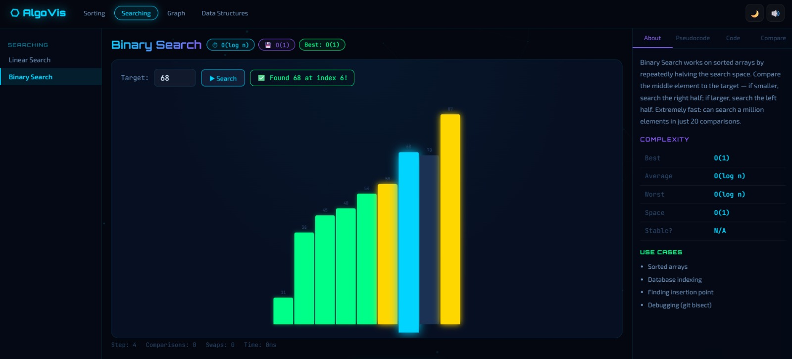

# ⬡ AlgoVis — DSA Algorithm Visualizer

> **A portfolio-grade, interactive Data Structures & Algorithms visualizer built with pure HTML, CSS, and JavaScript. No frameworks. No dependencies (except Google Fonts). Just clean, well-commented code.**

[](https://dsaalgorithms.netlify.app/).
[](LICENSE)
[](https://developer.mozilla.org/en-US/docs/Web/HTML)
[](https://developer.mozilla.org/en-US/docs/Web/CSS)
[](https://developer.mozilla.org/en-US/docs/Web/JavaScript)

---

## 📸 Preview




---

## ✨ Features

### 🔢 Sorting Algorithms
| Algorithm | Best | Average | Worst | Stable |
|-----------|------|---------|-------|--------|
| Bubble Sort | O(n) | O(n²) | O(n²) | ✅ |
| Selection Sort | O(n²) | O(n²) | O(n²) | ❌ |
| Insertion Sort | O(n) | O(n²) | O(n²) | ✅ |
| Merge Sort | O(n log n) | O(n log n) | O(n log n) | ✅ |
| Quick Sort | O(n log n) | O(n log n) | O(n²) | ❌ |

### 🔍 Searching Algorithms
- **Linear Search** — O(n), works on unsorted arrays
- **Binary Search** — O(log n), requires sorted array

### 🌐 Graph Algorithms
- **BFS** — Breadth-First Search (level-by-level, uses queue)
- **DFS** — Depth-First Search (deep exploration, uses stack/recursion)

### 📦 Data Structures
- **Stack** — LIFO with push, pop, peek
- **Queue** — FIFO with enqueue, dequeue, front
- **Linked List** — Head insertion, deletion, traversal
- **Binary Search Tree** — Insert, delete, search with path animation

### 🎛️ Controls
- ▶ Start / ⏸ Pause / ↺ Reset
- ⏭ Step-by-step execution
- 🎚️ Array size slider (5–80 elements)
- ⚡ Speed slider (1–10)
- 🔊 Web Audio sound effects
- 🌙 Dark/Light theme toggle

### 📚 Info Panel (per algorithm)
- Algorithm description
- Time & space complexity table
- Pseudocode
- Code implementations (JavaScript, Python, C++)
- Performance comparison chart

---

## 📁 Project Structure

```
algovis/
├── index.html                    # Main HTML entry point
├── css/
│   └── style.css                 # All styles (dark futuristic theme)
├── js/
│   ├── data.js                   # Algorithm metadata, code snippets
│   ├── particles.js              # Background particle animation
│   ├── sound.js                  # Web Audio sound engine
│   ├── app.js                    # Main controller, event wiring
│   ├── compareChart.js           # Canvas performance chart
│   ├── algorithms/
│   │   ├── sorting.js            # Sorting step generators
│   │   ├── searching.js          # Search step generators
│   │   └── graph.js              # BFS/DFS step generators
│   └── visualizers/
│       ├── sortViz.js            # Bar chart sort renderer
│       ├── searchViz.js          # Search bar renderer
│       ├── graphViz.js           # SVG graph renderer
│       ├── dsViz.js              # Stack/Queue/LinkedList renderer
│       └── bstViz.js             # BST SVG renderer
├── README.md
└── LICENSE
```

---

## 🚀 Quick Start

### Option 1 — Just open it
```bash
git clone https://github.com/swathi25-09/algovis.git
cd algovis
# Open index.html in any modern browser
open index.html        # macOS
start index.html       # Windows
xdg-open index.html    # Linux
```

### Option 2 — Local dev server (recommended for consistent behavior)
```bash
# Using Python
python3 -m http.server 8080
# Visit: http://localhost:8080

# Using Node.js (npx)
npx serve .
# Visit: http://localhost:3000

# Using VS Code
# Install "Live Server" extension → right-click index.html → "Open with Live Server"
```

---

## 🌐 Deployment

### GitHub Pages (Free)
1. Push your code to a GitHub repository
2. Go to **Settings → Pages**
3. Under **Source**, select `main` branch and `/ (root)` folder
4. Click **Save** — your site will be live at:
   `https://your-username.github.io/algovis`

### Netlify (Free, instant)
1. Go to [netlify.com](https://netlify.com) and sign in
2. Click **"Add new site" → "Deploy manually"**
3. Drag and drop your entire project folder
4. Your site is live immediately at a `*.netlify.app` URL
5. (Optional) Go to **Site settings → Change site name** to customize your URL

### Vercel (Free)
```bash
npm i -g vercel
cd algovis
vercel
# Follow prompts → deployed in seconds
```

---

## 🧠 Algorithm Deep Dives

### Bubble Sort
Repeatedly compares adjacent elements and swaps them if out of order. Each full pass "bubbles" the largest unsorted element to its final position. Includes an early-exit optimization: if no swaps occur in a pass, the array is already sorted.

**When to use:** Teaching, tiny arrays (< 20 elements), nearly-sorted detection.

### Selection Sort
Finds the minimum element in the unsorted portion and places it at the beginning. Makes at most **n−1 swaps** — ideal when memory writes are expensive.

**When to use:** When minimising swaps is critical.

### Insertion Sort
Builds the sorted array one element at a time by inserting each new element into its correct position. Efficient for small arrays and is used as the base case in **TimSort** (Python's and Java's built-in sort).

**When to use:** Small arrays, nearly sorted data, online algorithms.

### Merge Sort
Divide-and-conquer: split the array in half recursively, sort each half, then merge. **Guarantees O(n log n)** in all cases. Requires O(n) extra space.

**When to use:** Large datasets, linked lists, external sorting, stable sort requirements.

### Quick Sort
Picks a pivot, partitions elements around it, and recursively sorts each side. **Fastest in practice** for large datasets due to cache efficiency. Worst case O(n²) with bad pivot selection (mitigated with random pivot).

**When to use:** General-purpose sorting, system libraries (V8, libc).

### Binary Search
Cuts the search space in half on each comparison. **Requires a sorted array.** Can find a target in 1,000,000 elements in just ~20 comparisons.

**When to use:** Sorted arrays, database lookups, finding insertion points.

### BFS
Explores all neighbors at current depth before going deeper. Uses a **queue** (FIFO). Guarantees shortest path in unweighted graphs.

**When to use:** Shortest path, social network distance, web crawling.

### DFS
Explores as far as possible along each branch before backtracking. Uses a **stack** (or recursion). Great for detecting cycles and topological sort.

**When to use:** Cycle detection, maze solving, topological ordering.

---

## 🎨 Design System

| Token | Value |
|-------|-------|
| Primary | `#00d4ff` (Neon Cyan) |
| Secondary | `#8b5cf6` (Neon Purple) |
| Accent | `#00ff88` (Neon Green) |
| Background | `#04070f` (Deep Space) |
| Font Display | Orbitron |
| Font Mono | JetBrains Mono |
| Font Body | Exo 2 |

---

## 🛠️ Tech Stack

| Technology | Usage |
|------------|-------|
| HTML5 | Semantic markup, SVG graphs |
| CSS3 | Grid/Flexbox layout, CSS variables, glassmorphism, animations |
| Vanilla JavaScript (ES6+) | All logic, DOM manipulation, generators |
| Web Audio API | Real-time sound effects |
| Canvas API | Background particles, comparison chart |
| SVG | Graph and BST visualizations |
| Google Fonts | Orbitron, JetBrains Mono, Exo 2 |

---

## 📄 License

MIT License — free for personal and commercial use.

---

## 👤 Author

**Swathi Javvadi**
- GitHub: [@swathi25-09](https://github.com/swathi25-09)
- LinkedIn: [swathi-javvadi](https://www.linkedin.com/in/swathi-javvadi/)

---

*Built with 💙 as a portfolio project to demonstrate DSA knowledge and frontend engineering skills.*
